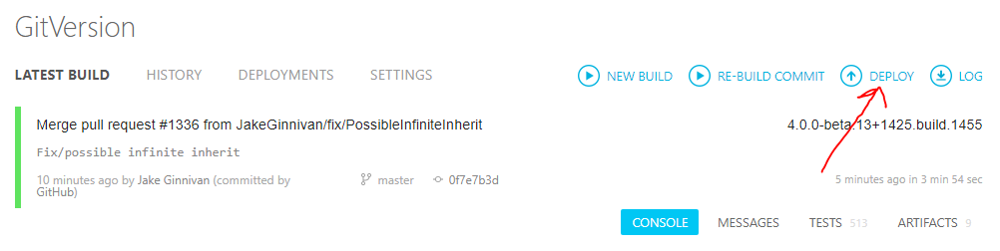
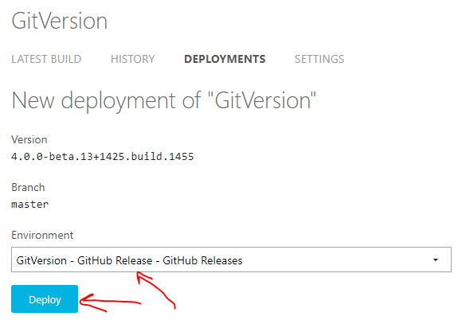
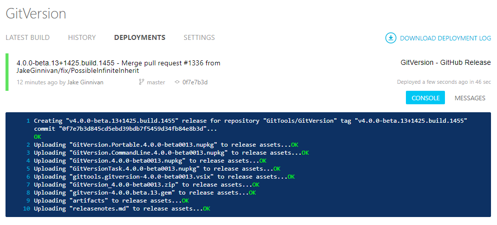
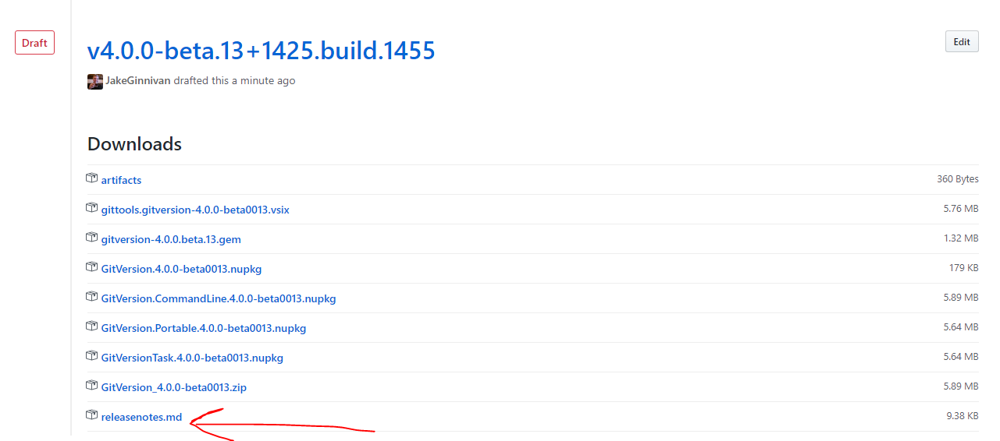

# Contributing to GitVersion

We love contributions to get started contributing you might need:

- [Get started with git](http://rogerdudler.github.io/git-guide)
- [How to create a pull request](https://help.github.com/articles/using-pull-requests)
- [An issue to work on](https://github.com/GitTools/GitVersion/labels/up-for-grabs) - We are on [Up for grabs](http://up-for-grabs.net/), our up for grabs issues are tagged `up-for-grabs`
- An understanding of our [architecture](http://gitversion.readthedocs.org/en/latest/more-info/how-it-works/#architecture) and how [we write tests](#writing-tests)

Once you know how to create a pull request and have an issue to work on, just post a comment saying you will work on it.
If you end up not being able to complete the task, please post another comment so others can pick it up.

Issues are also welcome, [failing tests](#writing-tests) are even more welcome.

## Contribution Guidelines

- Try to use feature branches rather than developing on master.
- Please include tests covering the change.
- The documentation is stored in the repository under the [`docs`](docs) folder.
   Have a look at the [documentation readme file](docs/readme.md) for guidance
   on how to improve the documentation and please include documentation updates
   with your PR.

## How it works

See [how it works](http://gitversion.readthedocs.org/en/latest/more-info/how-it-works/) in GitVersion's documentation

## Writing Tests

We have made it super easy to write tests in GitVersion. Most tests you are interested in are in `GitVersionCore.Tests\IntegrationTests`.

There is a scenario class for each type of branch. For example MasterScenarios, FeatureBranchScenarios etc.

### 1. Find Appropriate Scenario class

Find where your issue would logically sit. Or create a new scenario class if it doesn't fit anywhere in particular.

### 2. Create a test method

We are currently using NUnit, so just create a descriptive test method and attribute it with `[Test]`

### 3. Use a fixture

We have a few fixtures for different scenarios.

- `EmptyRepositoryFixture` - Gives you an empty git repo to start with
- `RemoteRepositoryFixture` - A local repo tracking a test remote repository. The remote repo is available through the `Repository` property, the local is accessible via `LocalRepository`
- `BaseGitFlowRepositoryFixture` - A repo setup for GitFlow (has a develop branch checked out ready to go)

You can use a fixture by just `using` it. Like this

``` csharp
using (var fixture = new EmptyRepositoryFixture(new Config()))
{
}
```

### 4. Customize config

If you are using non-default configuration just modify the `Config` class before creating the fixture

### 5. Writing the scenario

We have a number of extension method off `IRepository` to make it easy to write tests at the flow level and not worry about creating/commiting files.

An example test looks like this:

``` csharp
fixture.Repository.MakeATaggedCommit("1.0.0");
fixture.Repository.CreateBranch("feature-test");
fixture.Repository.Checkout("feature-test");
fixture.Repository.MakeACommit();
fixture.Repository.MakeCommits(4);

fixture.AssertFullSemver("1.0.1-test.1+5");
```

The last line is the most important. `AssertFullSemver` will run GitVersion and assert that the full SemVer it calculates is what you expect.

### 6. Submit a pull request with the failing test

Even better include the fix, but a failing test is a great start

## Build / Release Process

We use Cake for our build and deployment process. The way the build / release process is setup is:

1) We build releasable artifacts on AppVeyor
1) Login to AppVeyor
1) Deploy the latest master build

1) Choose GitVersion release, when you press deploy it will create a *non-released* GitHub release, this *will not* create a Git tag. This step is so we can validate the release and release notes before pushing the button.

1) All the artifacts should upload nicely

1) Head over to GitHub releases, you should have a draft release, download a copy of the release notes

1) Edit the release and do the following:
    1. Remove the build metadata from the tag and title (the + and everything after it)
    2. Paste the downloaded release notes in, you can clean them up if you want otherwise there may be closed issues which were questions etc.
    3. Tick the pre-release box if it's pre-release
    4. Press Publish
1) Publishing tags (a git tag) the release commit, this will trigger another appveyor build which only builds tags, this build uses deploy.cake. It downloads the artifacts from that GitHub release, then performs the release

## Docker

It is a manual release step after the release now, first download the appropriate ZIP and put into a `releaseArtifacts` folder in the GitVersion repository, then run:

```bash
docker build . --build-arg GitVersionZip=GitVersion_<VERSION>.zip --tag gittools/gitversion
```
