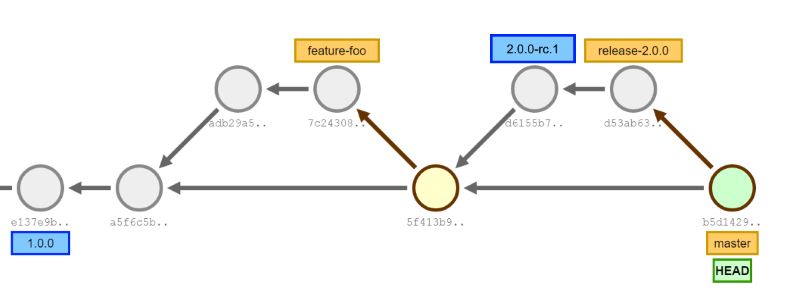

The easy way to use semantic versioning (semver.org) with a Git. Running GitVersion will calculate the SemVer of your application by looking at your git history. 

GitVersion in action!


You are seeing:

 - Pull requests being built as pre-release builds
 - A branch called `release-1.0.0` producing beta v1 packages

## Examples

## How it works


At each commit sha GitVersion will calculate:

```
e137e9		->		1.0.0+0
a5f6c5		->		1.0.1+1
adb29a		->		1.0.1-feature-foo.1+1 (PR #5 Version: `1.0.1-PullRequest.5+2`)
7c2438		->		1.0.1-feature-foo.1+2 (PR #5 Version: `1.0.1-PullRequest.5+3`)
5f413b		->		1.0.1+4
d6155b		->		2.0.0-rc.1+0 (Before and after tag)
d53ab6		->		2.0.0-rc.2+1 (Pre-release number was bumped because of the tag on previous commit)
b5d142		->		2.0.0+0 (2.0.0 branch was merged, so master is now at 2.0.0)
```

This is just a small sample of the way GitVersion works. The idea is you just plug it in and you will get sensible version numbers by default. We support the following branch types ootb:

 - master
 - develop
 - hotfix/
 - feature/
 - pull requests (stash, github and a few others)
 - support/
 - release/

If you have other branch types GitVersion is entirely configuration driven, so check out the [Configuration](#Configuration) section of the readme to understand how to make GitVersion work for you.

### The rules
GitVersion has a few things which can impact the version, first we calculate the base version then we increment if needed and finally we calculate the build metadata (including commit count). 
The exception, if a commit is tagged we always use that version. 

There are a few ways the base version is found, they are:

 - Git tag (increments using default rules)
 - Version in branch name - for example `release-1.0.0` (does not get incremented)
 - Merge message - so when the versioned branch is merged the version is carried with it (does not get incremented)
 - GitVersion.yaml configuration file (`next-version` property) (does not get incremented)

The commit counting is done from where the base version originated from.

<a name='continuousdeployment' />
## Octopus Deploy/CI Build NuGet Packages
Those of you who have tried to do SemVer with Octopus Deploy or consume CI packages out of TeamCity would have hit 
the problem that the SemVer version does not change each commit.

By default GitVersion is setup for *continuous delivery*, meaning that when you want to release you publish the artifact attached to 
your CI Build ([read more about what this means](https://github.com/ParticularLabs/GitVersion/wiki/Continuous-Delivery-Mode)).

If you want to consume packages from you CI server, for instance Octopus Deploy is looking at TeamCity's NuGet feed then you want GitVersion's *continuous deployment mode*. 
See the [Configuration](#configuration)

When using the continuous deployment mode all builds *must* have a pre-release tag, except for builds which are explicitly tagged as stable. 
Then the build metadata (which is the commit count) is promoted to the pre-release tag. Applying those rules the above commit graph would produce:

```
e137e9		->		1.0.0+0
a5f6c5		->		1.0.1-ci.1
adb29a		->		1.0.1-feature-foo.1 (PR #5 Version: `1.0.1-PullRequest.5+2`)
7c2438		->		1.0.1-feature-foo.2 (PR #5 Version: `1.0.1-PullRequest.5+3`)
5f413b		->		1.0.1-ci.4
d6155b		->		2.0.0-rc.1+4 (Before and after tag)
d53ab6		->		2.0.0-rc.2 (If there was another commit on the release branch it would be 2.0.0-rc.3)
b5d142		->		2.0.0-ci.0 (2.0.0 branch was merged, so master is now at 2.0.0)
```

As you can see the versions now no longer conflict. When you want to create a stable `2.0.0` release you simply `git tag 2.0.0` then build the tag and it will produce a stable 2.0.0 package.

For more information/background on why we have come to this conclusion read [Xavier Decoster's blog post on the subject](http://www.xavierdecoster.com/semantic-versioning-auto-incremented-nuget-package-versions).
The issue has also been discussed in quite a few issues. If you have other thoughts on this subject please open an issue to discuss!

### NuGet Compatibility
Again, if you have used NuGet you would notice the versions above are not compatible with NuGet. GitVersion solves this by providing *variables*.

What you have seen above is the **SemVer** variable. You can use the **NuGetVersion** variable to have the version formatted in a NuGet compatible way. 
So `1.0.1-rc.1+5` would become `1.0.1-rc0001`, this takes into account characters which are not allowed and NuGets crap sorting.

**note: ** The `NuGetVersion` variable is floating, so when NuGet 3.0 comes out with proper SemVer support GitVersion will switch this variable to a proper SemVer. 
If you want to fix the version, use `NuGetVersionV2` which will stay the same after NuGet 3.0 comes out

## Variables
Variables are quite useful if you need different formats of the version number. Running `GitVersion.exe` in your repo will show you what is available. 
For the `release/3.0.0` branch of GitVersion it shows:
```json
{
  "Major":3,
  "Minor":0,
  "Patch":0,
  "PreReleaseTag":"beta.1",
  "PreReleaseTagWithDash":"-beta.1",
  "BuildMetaData":1,
  "FullBuildMetaData":"1.Branch.release/3.0.0.Sha.28c853159a46b5a87e6cc9c4f6e940c59d6bc68a",
  "MajorMinorPatch":"3.0.0",
  "SemVer":"3.0.0-beta.1",
  "LegacySemVer":"3.0.0-beta1",
  "LegacySemVerPadded":"3.0.0-beta0001",
  "AssemblySemVer":"3.0.0.0",
  "FullSemVer":"3.0.0-beta.1+1",
  "InformationalVersion":"3.0.0-beta.1+1.Branch.release/3.0.0.Sha.28c853159a46b5a87e6cc9c4f6e940c59d6bc68a",
  "BranchName":"release/3.0.0",
  "Sha":"28c853159a46b5a87e6cc9c4f6e940c59d6bc68a",
  "NuGetVersionV2":"3.0.0-beta0001",
  "NuGetVersion":"3.0.0-beta0001"
}

```

## Configuration
GitVersion 3.0 is mainly powered by configuration and no longer has branching strategies hard coded.  
**Note:** GitVersion ships with internal default configuration which works with GitHubFlow and GitFlow, probably with others too. You **do not** need to run `GitVersion /init` to get started! 
The *develop* branch is set to `ContinuousDeployment` mode by default as we have found that is generally what is needed when using GitFlow.

You can run `GitVersion /showConfig` to see the effective configuration (defaults + overrides)

To create your config file just type `GitVersion init` in your repo directory after installing via chocolatey and we will create a sample (but commented out) config file. 
Uncomment and modify as you need. 

The configuration options are:

 - `next-version`: Allows you to bump the next version explicitly, useful for bumping `master` or a feature with breaking changes a major increment.
 - `assembly-versioning-scheme`: When updating assembly info tells GitVersion how to treat the AssemblyVersion attribute. Useful to lock the major when using Strong Naming.
 - `mode`: Either ContinuousDelivery or ContinuousDeployment. See [Octopus Deploy/CI Build NuGet Packages](#continuousdeployment) above for more information
 - `continuous-delivery-fallback-tag`: When using `mode: ContinuousDeployment` the value specified will be used as the pre-release tag for branches which do not have one specified.
 - `tag-prefix`: A regex which is used to trim git tags before processing (eg v1.0.0). Default is `[vV]` though this is just for illustrative purposes as we do a IgnoreCase match and could be `v`

#### Branch configuration

Then we have branch specific configuration, which looks something like this:

``` yaml
branches:
  master:
    tag: 
    increment: Patch
    prevent-increment-of-merged-branch-version: true
  (pull|pull\-requests|pr)[/-]:
    tag: PullRequest
    increment: Inherit
    tag-number-pattern: '[/-](?<number>\d+)[-/]'
```

The options in here are:
 - `mode`: Same as above
 - `tag`: The pre release tag to use for this branch. Use the value `use-branch-name-as-tag` to use the branch name instead.  
   For example `feature/foo` would become a pre-release tag of `foo` with this value
 - `increment`: the part of the SemVer to increment when GitVersion detects it needs to be (i.e commit after a tag)
 - `prevent-increment-of-merged-branch-version`: When `release-2.0.0` is merged into master, we want master to build `2.0.0`.
    If `release-2.0.0` is merged into develop we want it to build `2.1.0`, this option prevents incrementing after a versioned branch is merged
 - `tag-number-pattern`: Pull requests require us to pull the pre-release number out of the branch name so `refs/pulls/534/merge` builds as `PullRequest.5`. 
   This is a regex with a named capture group called `number`
 - `track-merge-target`: Strategy which will look for tagged merge commits directly off the current branch. For example
   develop -> release/1.0.0 -> merge into master and tag 1.0.0. The tag is *not* on develop, but develop should be 1.0.0 now.

We don't envision many people needing to change most of these configuration values, but they are there if you need to.

## Build Server support
GitVersion has support for quite a few build servers out of the box. Currently we support:

 - TeamCity
 - AppVeyor
 - Continua Ci
 - MyGet

When GitVersion.exe is run with the `/output buildserver` flag instead of outputting Json it will export variables to the current build server. 
For instance if you are running in TeamCity after you run `GitVersion /output buildserver` you will have the `%system.GitVersion.SemVer%` available for you to use

When running in MSBuild either from the MSBuild Task or by using the `/proj myproject.sln` GitVersion will make the MSBuild variables available in the format `$(GitVersion_SemVer)`.

## MSBuild Task/Ruby Gem/API
GitVersion has multiple ways it can be consumed.

 - [A Command Line tool](https://github.com/Particular/GitVersion/wiki/Command-Line-Tool)
 - [An MSBuild Task](https://github.com/Particular/GitVersion/wiki/MSBuild-Task-Usage)
 - [A NuGet Library package](https://github.com/Particular/GitVersion/wiki/GitVersion-NuGet-Library) - to use from your own code
 - [A Ruby Gem](https://github.com/Particular/GitVersion/wiki/Ruby-Gem)

### Examples
We have a bunch of examples in our Wiki, if something is missing, let us know! There are examples for GitHubFlow and GitFlow

### Who is using GitVersion?
Find a list of projects who are currently using GitVersion [here](https://github.com/ParticularLabs/GitVersion/wiki/Who-is-using-GitVersion%3F)

## Additional Links

### [FAQ and Common Problems](https://github.com/Particular/GitVersion/wiki/FAQ)

### [Semantic Versioning](http://semver.org/)

### [Git Visualiser used above](http://onlywei.github.io/explain-git-with-d3/)

## Chat

Have questions?  Come join in the chat room:

[](https://gitter.im/ParticularLabs/GitVersion?utm_source=badge&utm_medium=badge&utm_campaign=pr-badge&utm_content=badge)

## Icon
<a href="http://thenounproject.com/noun/tree/#icon-No13389" target="_blank">Tree</a> designed by <a href="http://thenounproject.com/david.chapman" target="_blank">David Chapman</a> from The Noun Project
