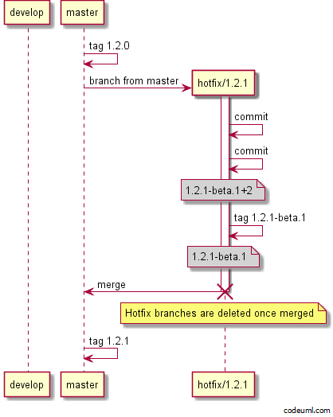
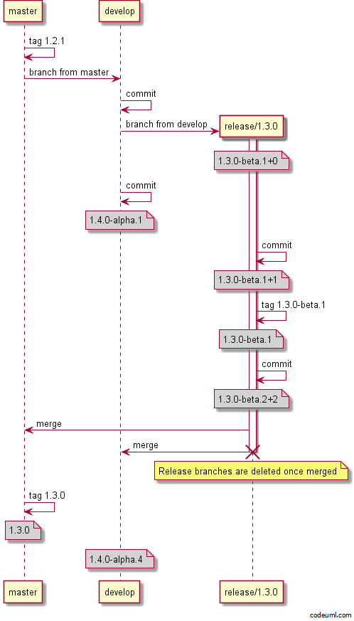
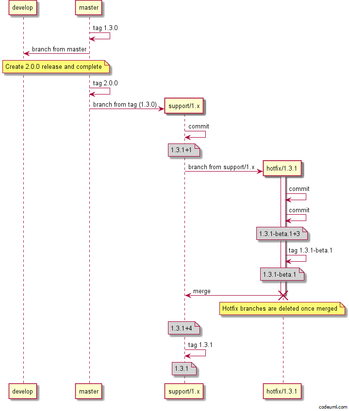

# GitFlow Examples
These examples are using the *default* configuration with GitVersion. Which is [continuous deployment](../reference/continuous-deployment.md) mode for `develop` and [continuous delivery](../reference/continuous-delivery.md) mode for all other branches.

This default configuration allows you to publish CI builds from develop to a CI MyGet feed, or another CI feed. Then all other branches are manually released then tagged. Read more about this at [version increments](../more-info/version-increments.md).

## Feature Branches
Feature branches will take the feature branch name and use that as the pre-release tag.

Notice after the feature branch is merged, the version on `develop` is `1.3.0-alpha.3`. This is due to `develop` running in *continuous deployment* mode. If you configured `develop` to use *continuous delivery* the version would still be `1.3.0-alpha.1` and you would have to use release tags to increment the `alpha.1`.

You can see the different on the feature branch itself, notice the version is the same before and after the commit on the feature branch? Only the metadata has changed. If you released the feature branch artifacts then tagged the commit, the following commit would increase to `-beta.2`.

## Pull Request
Because feature branches are most likely pushed to a fork, we are showing the
pull request branch name which is created when you submit a pull request

## Hotfix Branches
Hotfix branches are used when you need to do a *patch* release in GitFlow and are always created off `master`

## Minor Release Branches
Release branches are used for both major and minor releases for stabilisation before a release. Release branches are taken off `develop` then merged to both `develop` and `master`. Finally `master` is tagged with the released version.

## Major Release Branches
Major releases are just like minor releases, the difference is you bump the major in the release branch name.

## Support Branches
Support branches are not really covered in GitFlow, but are essential if you need to maintain multiple major versions at the same time. You could use support branches for supporting minor releases as well. If you are just supporting the majors, then name your branch `support/<major>.x` (i.e `support/1.x`), to support minors use `support/<major>.<minor>.x` or `support/<major>.<minor>.0`. (i.e `support/1.3.x` or `support/1.3.0`)

### Hotfix
Depending on what you name your support branch, you may or may not need a hotfix branch. Naming it `support/1.x` will automatically bump the patch, if you name it `support/1.3.0` then the version in branch name rule will kick in and the patch *will not* automatically bump, meaning you have to use hotfix branches.

### Minor Release

## To Update/Contribute
See [creating/updating examples](creating-updating-examples.md)
