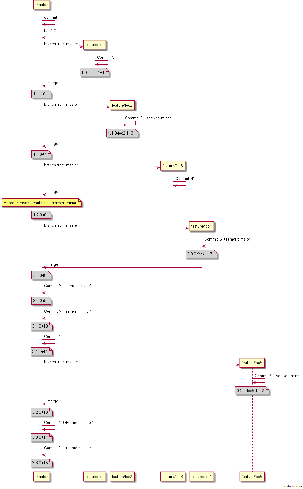

Mainline Development is enabled when using
[GitHubFlow](../../git-branching-strategies/githubflow) or any other strategy
where you develop on `master`. The main rule of mainline development is that
**master is always in a state that it could be deployed to production**. This
means that pull requests should not be merged until they are ready to go out.

To properly achieve mainline development you need confidence in your test suite
as if it goes green against a PR then you are confident that you can merge and
release that pull request. Another property of mainline development is normally
that you fix going forward, not revert. When an issue is discovered with a
release, add a test or some sort of check to make sure it won't happen again,
fix the issue, then do a release with the fix.

Like all things, it is an approach and will work for some people and not for
others. GitVersion is unique in the fact that it works very well with mainline
development and the version numbers it generates are *predictive* and indicate
what the next version to be released is. Most other approaches require bumping
the version number before the release which means that the version being built
and the version number which will be deployed are often different.

This mode is great if you do not want to tag each release because you simply
deploy every commit to master. The behaviour of this mode is as follows:

1. Calculate a base version (likely a tag in this mode)
2. Walk all commits from the base version commit
3. When a merge commit is found:
    - Calculate increments for each direct commit on master
    - Calculate the increment for the branch
4. Calculate increments for each remaining direct commit
5. For feature branches then calculate increment for the commits so far on your
   feature branch.

If you *do not want* GitVersion to treat a commit or a pull request as a release
and increment the version you can use `+semver: none` or `+semver: skip` in a
commit message to skip incrementing for that commit.

Here is an example of what mainline development looks like:



:::{.alert .alert-warning}
**Warning**

This approach can slow down over time, we recommend to tag
intermittently (maybe for minor or major releases) because then GitVersion
will start the version calculation from that point. Much like a snapshot in an
event sourced system. We will probably add in warnings to tag when things are
slowing down.
:::

## Usage
By default GitVersion is set up to do [Continuous Delivery](continuous-delivery)
versioning on all branches but `develop` (which does
[Continuous Deployment](continuous-deployment) by default). To change the
[versioning mode](versioning-mode) to Mainline Development, just
change the [configuration](../../configuration) as such:

```yaml
mode: Mainline
```
