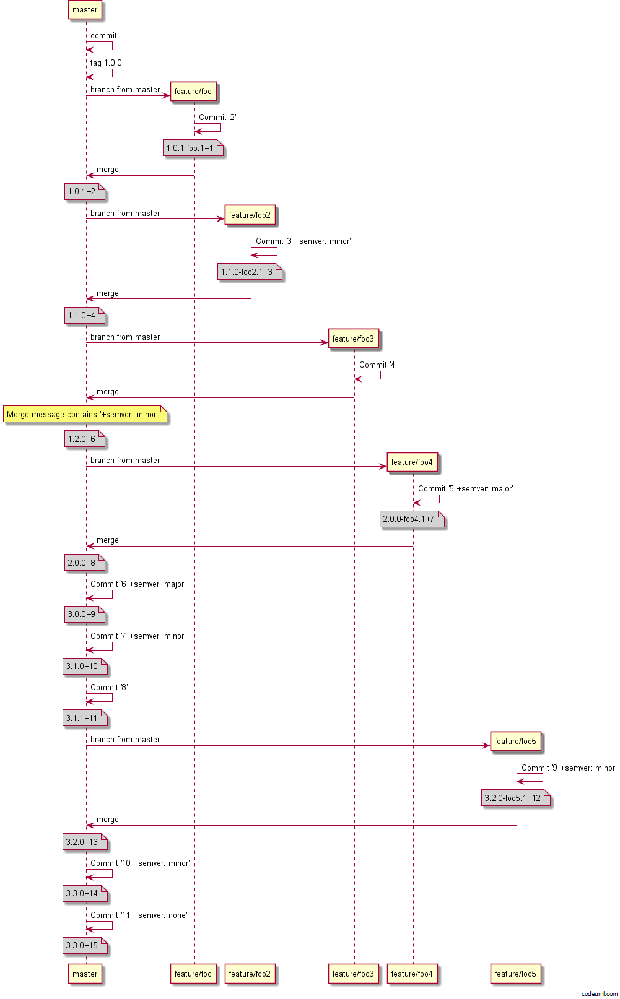

# Versioning modes
GitVersion has multiple modes to fit different different ways of working.

## Continuous Delivery
This is the default mode, GitVersion calculates the next version and will use that until that is released. For instance:

 - 1.1.0+5
 - 1.1.0+6
 - 1.1.0+7  <-- This is the artifact we release, tag the commit which created this version
 - 1.1.1+0

Tags are required in this mode to communicate when the release is done as it's an external manual process.

## Continuous deployment
Sometimes you just want the version to keep changing and continuously deploy. A good case for this is when using Octopus deploy, as you cannot publish the same version of a package into the same feed.

For this mode we followed the logic in this blog post by Xavier Decoster on the issues of incrementing automatically - http://www.xavierdecoster.com/semantic-versioning-auto-incremented-nuget-package-versions

As such we force a pre-release tag on all branches, this is fine for applications but can cause problems for libraries. As such this mode may or may not work for you, which leads us into a new mode in v4. Mainline development.

## Mainline development
Mainline development works more like the Continuous Delivery mode, except that it tells GitVersion to *infer* releases from merges and commits to `master`.

This mode is great if you do not want to tag each release because you simply deploy every commit to master. The behaviour of this mode is as follows:

1. Calclate a base version (likely a tag in this mode)
1. Walk all commits from the base version commit
1. When a merge commit is found:
    - Calculate increments for each direct commit on master
    - Calculate the increment for the branch
1. Calculate increments for each remaining direct commit
1. For feature branches then calculate increment for the commits so far on your feature branch.

If you *do not want* GitVersion to treat a commit or a pull request as a release and increment the version you can use `+semver: none` or `+semver: skip` in a commit message to skip incrementing for that commit.

Here is an example of what mainline development looks like:

**WARNING:** This approach can slow down over time, we recommend to tag intermitently (maybe for minor or major releases) because then GitVersion will start the version calculation from that point. Much like a snapshot in an event sourced system. We will probably add in warnings to tag when things are slowing down.